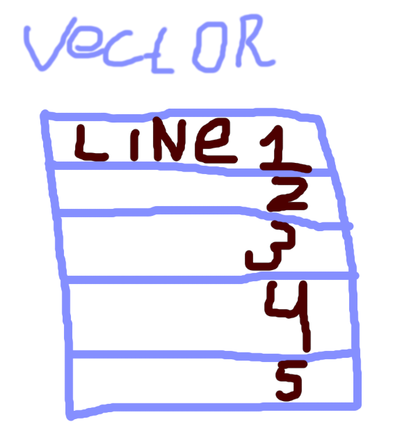

# The simple console editor for Linux

This is a training project.

Run
```bash
mkdir ./build
cd build/
cmake ../
make

./app <FILE>
```

### What was done?

- Navigating through text;
- Insert;
- Implementation of text cleaning (backspace);

### Third party dependencies used:

- ncurses

